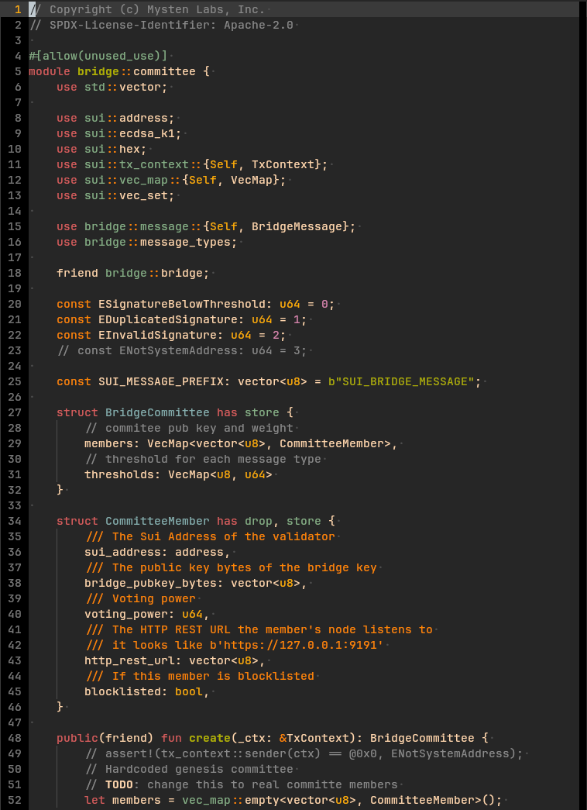

# move.vim 
Syntax highlighting for the Move (Sui flavor) smart contract programming 
language. Open to PRs to extend this tool. 



### Installation

Install via your vim plugin manager of choice.

For `vim-plug` add to your `.vimrc`:

```
Plug 'roman1e2f5p8s/sui-move.vim'
```

Then run `:PlugInstall`.
